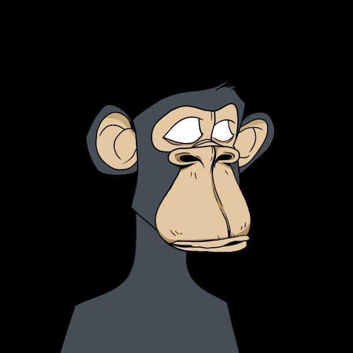
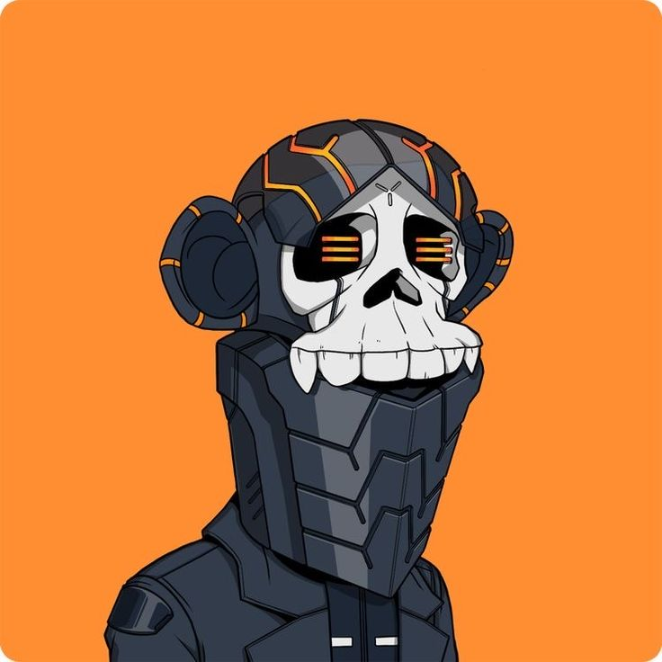
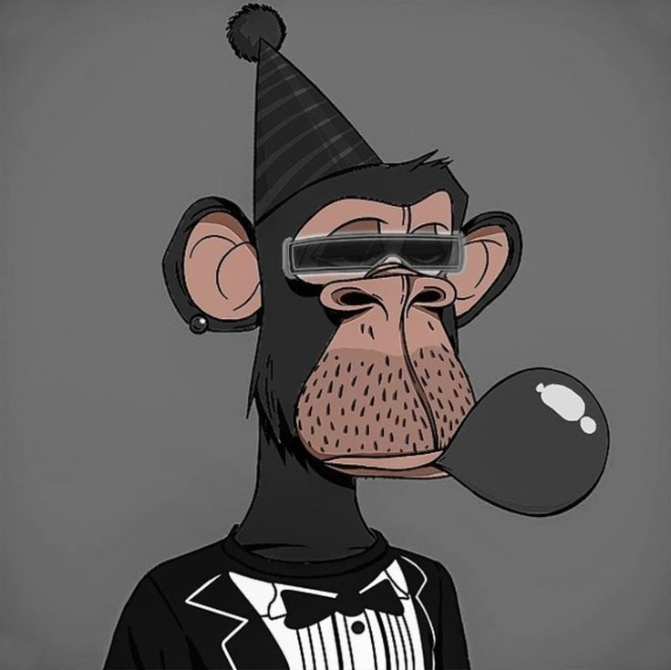
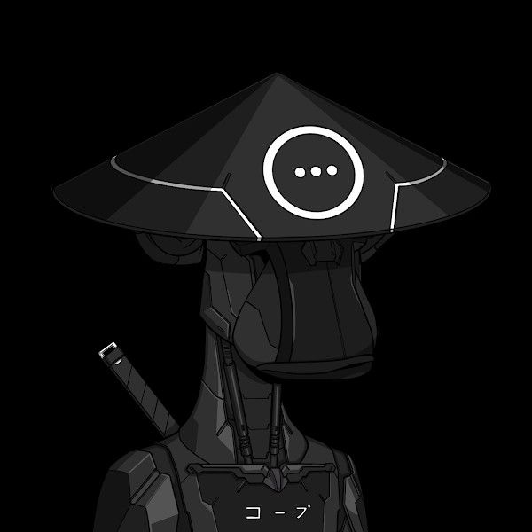
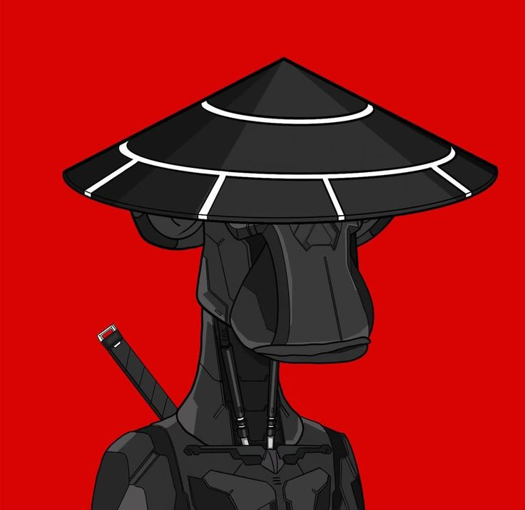
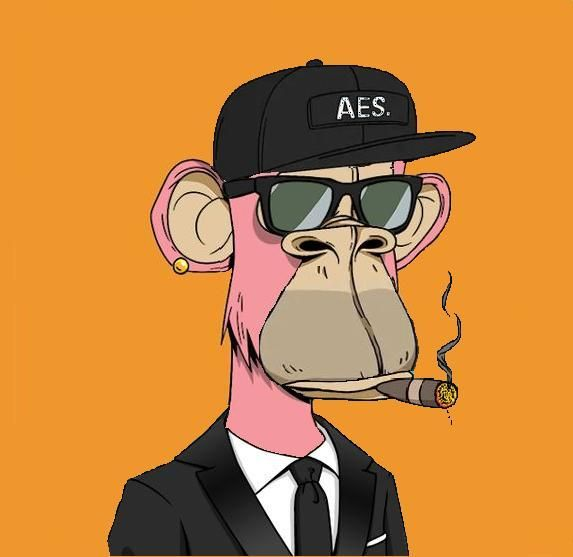
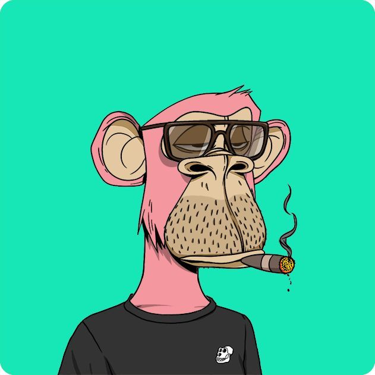

# DM | Dreamer NFT

<p align="center">
  
</p>

A high-end, immersive digital art gallery and NFT marketplace prototype. **Dreamer NFT** focuses on a brutalist, minimalist aesthetic with high-performance animations and a unique visual identity.

## 🖼️ Visual Preview

### Core Collection
<p align="center">
  
  
  
  
</p>

<p align="center">
  
  
  
  
</p>

## 🚀 Key Features

- **Dynamic NFT Grid (Hero):** A scattered, depth-of-field visual experience that showcases project diversity with cinematic focus and interactive highlighting.
- **GSAP Immersive Animations:** Fluid, high-performance transitions and entry sequences using GSAP (GreenSock Animation Platform).
- **Curated Collections:** Dedicated pages for latest projects and visionary artists with integrated NFT asset management.
- **Brutalist Design System:** A focused palette and typography (Barlow Condensed) that prioritizes digital art and minimalist UI.
- **SEO Optimized:** Fully integrated SEO components for better discoverability.
- **Responsive & Performant:** Built with Vite and TypeScript for lightning-fast development and optimized production builds.

## 🛠️ Tech Stack

- **Frontend:** React 18 + TypeScript
- **Styling:** Tailwind CSS + Vanilla CSS (for custom brutalist effects)
- **Animations:** GSAP
- **Routing:** React Router DOM
- **Meta Tags:** React Helmet Async
- **Build Tool:** Vite

## 📦 Project Structure

```text
src/
├── assets/           # NFT collection and static images
├── components/       # Shared UI components (Navbar, SEO, etc.)
└── pages/            # Core application views
    ├── hero.tsx      # Interactive NFT grid landing page
    ├── Projects.tsx  # Collection showcase
    └── Artists.tsx   # Creator profiles
```

## 🛠️ Getting Started

### Prerequisites
- Node.js (Latest LTS recommended)
- npm or yarn

### Installation

1. Clone the repository:
   ```bash
   git clone <repository-url>
   ```

2. Install dependencies:
   ```bash
   npm install
   ```

3. Start the development server:
   ```bash
   npm run dev
   ```

## 🎨 Visual Identity

The project uses a sophisticated earthy palette:
- **Background:** `#b5a99a` / `#d4c9bc`
- **Contrast:** `#0d0d0d` (Black)
- **Typography:** Barlow Condensed (900 weight for headers)

---
*Dreamer NFT - The future of digital art.*
